    <h1>Hi, I'm tiedan 👋</h1>
    <h3>Master’s Student in Software Engineering at Northeastern University</h3>
    

---

## 🛠️ Languages and Tools

[//]: # ([![Go]&#40;https://img.shields.io/badge/Go-00ADD8?style=for-the-badge&logo=go&logoColor=FFFFFF&#41;]&#40;https://golang.google.cn/&#41;)

## 🌟 Featured Projects

### 🤝 Projects Collaborating with Others
- [Slontia/**lgtbot**](https://github.com/Slontia/lgtbot) - Chat room game referee bot, supporting 100+ active users/day (C++)

### 🚧 Projects I'm Currently Working On
- [**tiedangh.github.io**](https://github.com/tiedanGH/tiedangh.github.io) - a small game website based on GitHub Pages (JavaScript, CSS, HTML)
- [**mirai compiler framework**](https://github.com/tiedanGH/mirai-compiler-framework/) - Mirai Console online compiler framework based on Glot API (Kotlin)

### ✅ Past Projects
- [**Online Retail Store**](https://github.com/tiedanGH/Online-Retail-Store) - Full-stack e-commerce web app with Spring Boot, Hibernate, MySQL, JSP, Bootstrap (Java)
- [**webapp**](https://github.com/CNWebApp/webapp) - Spring Boot web app with RESTful API (Java, Gradle)
- [**tf-aws-infra**](https://github.com/CNWebApp/tf-aws-infra) - Terraform scripts for AWS infrastructure deployment (Terraform)
- [**imgloc uploader**](https://github.com/tiedanGH/imgloc-uploader) - Mirai Console image upload plugin based on imgloc API (Kotlin)
- [**Tank Fight Game**](https://github.com/tiedanGH/Tank-Fight-Game) - JavaFX-based tank fight game (Java)
- [**TiedanBot plugin**](https://github.com/tiedanGH/TiedanBot-plugin) - Mirai Console bot management plugin (Kotlin)

## 📬 Contact Me

| Platform             | Info                                                        |
|----------------------|-------------------------------------------------------------|
| **Gmail**            | [tiedan0227@gmail.com](mailto:tiedan0227@gmail.com)         |
| **University Email** | [yu.jiaq@northeastern.edu](mailto:yu.jiaq@northeastern.edu) |
| **QQ**               | [2295824927](https://qm.qq.com/q/hAIXBftS12)                |
